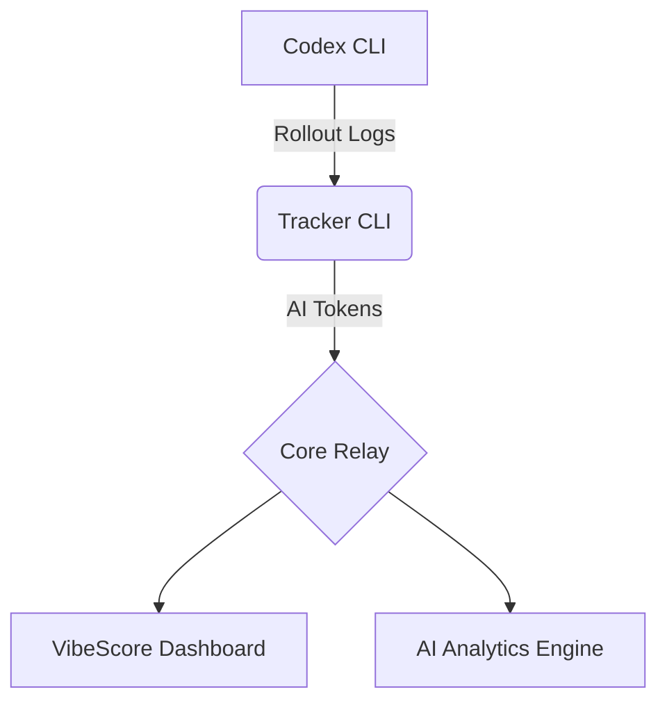

<div align="center">

# 🟢 VIBESCORE

**QUANTIFY YOUR AI OUTPUT**  
_Real-time AI Analytics for Codex CLI_

[**www.vibescore.space**](https://www.vibescore.space)

[](https://opensource.org/licenses/MIT)
[](https://nodejs.org/)
[](https://www.kernel.org/)

[**English**](README.md) • [**中文说明**](README.zh-CN.md)

[**Documentation**](docs/) • [**Dashboard**](dashboard/) • [**Backend API**](BACKEND_API.md)

<br/>


</div>

---

## 🌌 Overview

**VibeScore** is an intelligent token usage tracking system designed for macOS-first workflows, with CLI support on mainstream Linux (Ubuntu/Fedora/Arch). Through the all-new **Matrix-A Design System**, it provides a high-fidelity cyberpunk-style dashboard that transforms your **AI Output** into quantifiable metrics, supported by the **Neural Divergence Map** for real-time monitoring of multi-model compute distribution.

> [!TIP] > **Core Index**: Our signature metric that reflects your flow state by analyzing token consumption rates and patterns.

## 🔒 Privacy-First Architecture (Stealth Protocol)

We believe your code and thoughts are your own. VibeScore is built with strict privacy pillars to ensure your data never leaves your control.

- 🛡️ **No Content Upload**: We never upload prompts or responses. We only compute token counts locally and send counts plus minimal metadata (timestamps, model, device).
- 📡 **Local Aggregation**: All token consumption analysis happens on your machine. We only relay quantized 30-minute usage buckets to the cloud.
- 🔐 **Hashed Identity**: Device tokens are hashed using SHA-256 server-side. Your raw credentials never exist in our database.
- 🔦 **Full Transparency**: Audit the sync logic yourself in `src/lib/rollout.js`. We literally only capture numbers and timestamps.

## 🚀 Key Features

- 📡 **Auto-Sync**: Real-time interception of Codex CLI pipes with **automatic background synchronization**. Once initialized, your tokens are tracked and synced without any manual commands.
- 🧭 **Universal-Sync**: Native support for **Codex CLI**, **Every Code**, and the latest **Claude Code**. Whether it's GPT-4, Claude 3.5 Sonnet, or o1/Gemini, token consumption from all models is unified and counted.
- 📊 **Matrix Dashboard**: High-performance dashboard built with React + Vite, featuring the new **Matrix-A** design language.
  - **Neural Divergence Map**: Visualize multi-engine load balancing and compute distribution.
  - **Cost Intelligence**: Real-time, multi-dimensional cost breakdown and forecasting.
  - **Smart Notifications**: Non-intrusive system-level alerts using a Golden (Gold/Amber) visual style for high-value information.
- ⚡ **AI Analytics**: Deep analysis of Input/Output tokens, with dedicated tracking for Cached and Reasoning components.
- 🔒 **Identity Core**: Robust authentication and permission management to secure your development data.

### 🌌 Visual Preview


## 🛠️ Quick Start

### Installation

Initialize your environment once and forget it. VibeScore handles all synchronization in the background automatically.

```bash
npx --yes @vibescore/tracker init
```

Note: `init` shows a consent prompt in interactive shells. Use `--yes` to skip prompts in non-interactive environments.
Optional: `--dry-run` previews planned changes without writing files.
Note: If `~/.code/config.toml` exists (or `CODE_HOME`), `init` also configures Every Code `notify` automatically. No further user intervention is required for data sync.
Note: If Gemini CLI home exists, `init` installs a `SessionEnd` hook in `~/.gemini/settings.json` and sets `tools.enableHooks = true` so hooks execute. This enables all Gemini hooks; disable by setting `tools.enableHooks = false` (or disabling the `vibescore-tracker` hook).
Note: Linux support is CLI-only and officially covers Codex CLI + Claude Code sources.

### Sync & Status

````bash
While sync happens automatically, you can manually trigger a synchronization or check status anytime:

```bash
# Manually sync latest local session data (Optional)
npx --yes @vibescore/tracker sync

# Check current link status
npx --yes @vibescore/tracker status
````

### Sources

- Codex CLI logs: `~/.codex/sessions/**/rollout-*.jsonl` (override with `CODEX_HOME`)
- Claude Code logs: `~/.claude/projects/**/*.jsonl` (override with `CLAUDE_HOME`)
- Every Code logs: `~/.code/sessions/**/rollout-*.jsonl` (override with `CODE_HOME`)
- Gemini CLI logs: `~/.gemini/tmp/**/chats/session-*.json` (override with `GEMINI_HOME`)

## 🔧 Environment Variables

- `VIBESCORE_HTTP_TIMEOUT_MS`: CLI HTTP timeout in ms (default `20000`, `0` disables, clamped to `1000..120000`).
- `VITE_VIBESCORE_HTTP_TIMEOUT_MS`: Dashboard request timeout in ms (default `15000`, `0` disables, clamped to `1000..30000`).
- `CLAUDE_HOME`: Override Claude Code home (defaults to `~/.claude`).
- `GEMINI_HOME`: Override Gemini CLI home (defaults to `~/.gemini`).

## 🧰 Troubleshooting

### Streak shows 0 days while totals look correct

- Streak is defined as consecutive days ending today. If today's total is 0, streak will be 0.
- If you expect a non-zero streak, clear cached auth/heatmap data and sign in again:

```js
localStorage.removeItem("vibescore.dashboard.auth.v1");
Object.keys(localStorage)
  .filter((k) => k.startsWith("vibescore.heatmap."))
  .forEach((k) => localStorage.removeItem(k));
location.reload();
```

- Complete the landing page sign-in flow again after reload.
- Note: `insforge-auth-token` is not used by the dashboard; use `vibescore.dashboard.auth.v1`.

## 🏗️ Architecture



## 💻 Developer Guide

To run locally or contribute:

### Dashboard Development

```bash
# Install dependencies
cd dashboard
npm install

# Start dev server
npm run dev
```

### Debug Payload (Usage Endpoints)

When `debug=1` is included in a usage endpoint request, the response adds a `debug` object that helps the dashboard attribute slow queries without relying on response headers.

```ts
const res = await fetch(
  `${baseUrl}/functions/vibescore-usage-summary?from=2025-12-30&to=2025-12-30&debug=1`,
  {
    headers: { Authorization: `Bearer ${userJwt}` }
  }
);
const data = await res.json();

if (data.debug) {
  console.debug('usage debug', {
    requestId: data.debug.request_id,
    status: data.debug.status,
    queryMs: data.debug.query_ms,
    slowThresholdMs: data.debug.slow_threshold_ms,
    slowQuery: data.debug.slow_query
  });
}
```

### Architecture Validation

```bash
# Validate Copy Registry
npm run validate:copy

# Run smoke tests
npm run smoke
```

## 📜 License

This project is licensed under the [MIT License](LICENSE).

---

<div align="center">
  <b>System_Ready // 2024 VibeScore OS</b><br/>
  <i>"More Tokens. More Vibe."</i>
</div>
