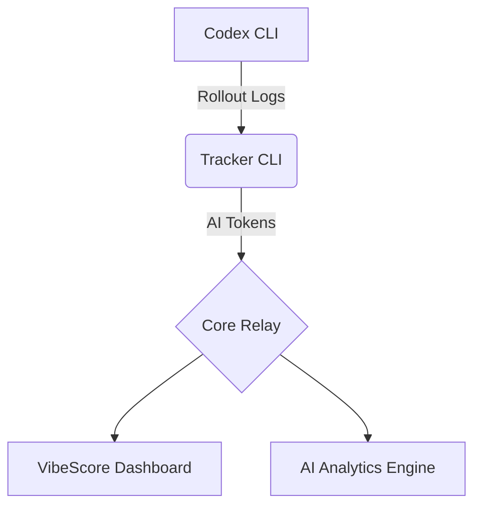

<div align="center">

# 🟢 VIBESCORE

**QUANTIFY YOUR AI OUTPUT**  
_Real-time AI Analytics for Codex CLI_

[**www.vibescore.space**](https://www.vibescore.space)

[](https://opensource.org/licenses/MIT)
[](https://nodejs.org/)
[](https://www.apple.com/macos/)

[**English**](README.md) • [**中文说明**](README.zh-CN.md)

[**Documentation**](docs/) • [**Dashboard**](dashboard/) • [**Backend API**](BACKEND_API.md)

</div>

---

## 🌌 Overview

**VibeScore** is an intelligent token usage tracking system designed specifically for macOS developers. It monitors Codex CLI output in real-time, transforming your **AI Output** into quantifiable metrics via a high-fidelity, **Matrix-themed** dashboard.

> [!TIP] > **Core Index**: Our signature metric that reflects your flow state by analyzing token consumption rates and patterns.

## 🚀 Key Features

- 📡 **Live Sniffer**: Real-time interception of Codex CLI pipes using low-level hooks to capture every completion event.
- 📊 **Matrix Dashboard**: A high-performance React + Vite dashboard featuring heatmaps, trend charts, and live logs.
- ⚡ **AI Analytics**: Deep analysis of Input/Output tokens, with dedicated tracking for Cached and Reasoning components.
- 🔒 **Identity Core**: Robust authentication and permission management to secure your development data.

## 🛠️ Quick Start

### Installation

Initialize your environment with a single command:

```bash
npx --yes @vibescore/tracker init
```

### Sync & Status

```bash
# Sync latest local session data
npx --yes @vibescore/tracker sync

# Check current link status
npx --yes @vibescore/tracker status
```

## 🧰 Troubleshooting

### Streak shows 0 days while totals look correct

- Streak is defined as consecutive days ending today. If today's total is 0, streak will be 0.
- If you expect a non-zero streak, clear cached auth/heatmap data and sign in again:

```js
localStorage.removeItem('vibescore.dashboard.auth.v1');
Object.keys(localStorage)
  .filter((k) => k.startsWith('vibescore.heatmap.'))
  .forEach((k) => localStorage.removeItem(k));
location.reload();
```

- Complete the landing page sign-in flow again after reload.
- Note: `insforge-auth-token` is not used by the dashboard; use `vibescore.dashboard.auth.v1`.

## 🏗️ Architecture



## 💻 Developer Guide

To run locally or contribute:

### Dashboard Development

```bash
# Install dependencies
cd dashboard
npm install

# Start dev server
npm run dev
```

### Architecture Validation

```bash
# Validate Copy Registry
npm run validate:copy

# Run smoke tests
npm run smoke
```

## 📜 License

This project is licensed under the [MIT License](LICENSE).

---

<div align="center">
  <b>System_Ready // 2024 VibeScore OS</b><br/>
  <i>"More Tokens. More Vibe."</i>
</div>
