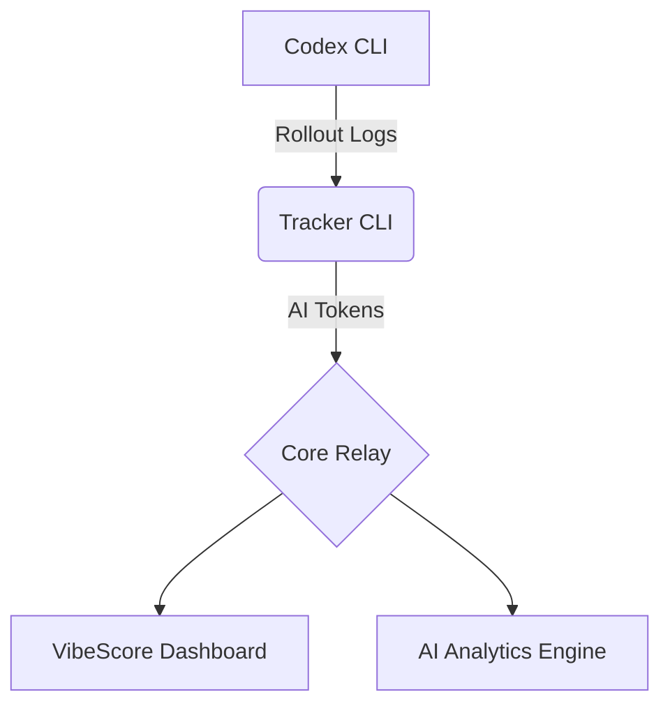

<div align="center">

# 🟢 VIBESCORE

**量化你的 AI 产出**  
_Codex CLI 实时 AI 分析工具_

[**www.vibescore.space**](https://www.vibescore.space)

[](https://opensource.org/licenses/MIT)
[](https://nodejs.org/)
[](https://www.kernel.org/)

[**English**](README.md) • [**中文说明**](README.zh-CN.md)

[**文档**](docs/) • [**控制台**](dashboard/) • [**后端接口**](BACKEND_API.md)

<br/>


</div>

---

## 🌌 项目概述

**VibeScore** 是一个 macOS 优先的智能令牌（Token）使用追踪系统，CLI 支持主流 Linux 发行版（Ubuntu/Fedora/Arch）。它通过全新的 **Matrix-A Design System**，提供高度可视化的赛博朋克风格仪表盘，将你的 **AI 产出 (AI Output)** 转化为可量化的指标，并支持通过 **Neural Divergence Map** 实时监控多模型的算力分布。

> [!TIP] > **Core Index (核心指数)**: 我们的标志性指标，通过分析 Token 消耗速率与模式，反映你的开发心流状态。

## 🔒 隐私优先架构 (隐身协议)

我们坚信你的代码和思想属于你自己。VibeScore 建立在严格的隐私支柱之上，确保你的数据始终处于受控状态。

- 🛡️ **内容不出本地**：我们从不上传 Prompt 或响应内容。只在本地计算 Token 数量，并上传 Token 计数与最小元数据（时间、模型、设备）。
- 📡 **本地聚合**：所有 Token 消耗分析均在你的机器上完成。我们仅将量化的 30 分钟使用桶（Usage Buckets）中继到云端。
- 🔐 **身份哈希**：设备令牌在服务端使用 SHA-256 进行哈希处理。你的原始凭据绝不会存在于我们的数据库中。
- 🔦 **全程透明**：你可以亲自审计 `src/lib/rollout.js` 中的同步逻辑。我们真正采集的只有数字和时间戳。

## 🚀 核心功能

- 📡 **自动嗅探与同步 (Auto-Sync)**: 实时监听 Codex CLI 管道并具备**全自动后台同步**功能。初始化后，你的 Token 产出将自动追踪并同步，无需手动执行脚本。
- 🧭 **全能采集 (Universal-Sync)**: 原生支持 **Codex CLI**, **Every Code** 以及最新的 **Claude Code**。无论是 GPT-4, Claude 3.5 Sonnet 还是 o1/Gemini，所有模型的 Token 消耗均可被统一捕获与统计。
- 📊 **Matrix Dashboard (矩阵控制台)**: 基于 React + Vite 的高性能仪表盘，采用全新的 **Matrix-A** 设计语言。
  - **Neural Divergence Map (神经发散图谱)**: 可视化多引擎负载均衡状态，直观展示算力分布。
  - **Cost Intelligence (成本智能)**: 实时、多维度的成本分解与预测。
  - **Smart Notifications (智能通知)**: 非侵入式的系统级通知，采用金色 (Gold/Amber) 视觉传达高价值信息。
- ⚡ **AI Analytics (AI 分析)**: 深度分析 Input/Output Token，支持缓存 (Cached) 与推理 (Reasoning) 部分的分离监控。
- 🔒 **Identity Core (身份核心)**: 完备的身份验证与权限管理，保护你的开发数据资产。

### 🌌 视觉预览


## 🛠️ 快速开始

### 安装

只需一次初始化，即可变身为“自动驾驶”模式。VibeScore 会在后台处理所有数据同步，你只需专注开发。

```bash
npx --yes @vibescore/tracker init
```

说明：交互式终端会显示授权菜单；非交互环境可使用 `--yes` 跳过。
可选：`--dry-run` 仅预览将发生的变更，不写入任何文件。
说明：若存在 `~/.code/config.toml`（或 `CODE_HOME`），`init` 会自动配置 Every Code 的 `notify`。配置完成后，数据同步完全自动化，无需后续人工干预。
说明：若检测到 Gemini CLI home，`init` 会在 `~/.gemini/settings.json` 安装 `SessionEnd` hook，并将 `tools.enableHooks = true` 以确保 hook 生效。这会启用所有 Gemini hooks；如需关闭，可将 `tools.enableHooks = false`（或禁用 `vibescore-tracker` hook）。
说明：Linux 仅支持 CLI，官方支持的数据源范围为 Codex CLI + Claude Code。

### 同步与状态查看

````bash
虽然同步是自动完成的，但你仍可以随时手动触发同步或查看状态：

```bash
# 手动同步最新的本地会话数据 (可选)
npx --yes @vibescore/tracker sync

# 查看当前连接状态
npx --yes @vibescore/tracker status
````

### 日志来源

- Codex CLI 日志：`~/.codex/sessions/**/rollout-*.jsonl`（可用 `CODEX_HOME` 覆盖）
- Claude Code 日志：`~/.claude/projects/**/*.jsonl`（可用 `CLAUDE_HOME` 覆盖）
- Every Code 日志：`~/.code/sessions/**/rollout-*.jsonl`（可用 `CODE_HOME` 覆盖）
- Gemini CLI 日志：`~/.gemini/tmp/**/chats/session-*.json`（可用 `GEMINI_HOME` 覆盖）

## 🔧 环境变量

- `VIBESCORE_HTTP_TIMEOUT_MS`：CLI 请求超时（毫秒，默认 `20000`，`0` 表示关闭，范围 `1000..120000`）。
- `VITE_VIBESCORE_HTTP_TIMEOUT_MS`：Dashboard 请求超时（毫秒，默认 `15000`，`0` 表示关闭，范围 `1000..30000`）。
- `CLAUDE_HOME`：覆盖 Claude Code 的 home（默认 `~/.claude`）。
- `GEMINI_HOME`：覆盖 Gemini CLI 的 home（默认 `~/.gemini`）。

## 🧰 常见问题

### Streak 显示 0 天但总量正常

- Streak 的口径是“从今天开始连续使用的天数”，如果今天的 total 为 0，streak 就是 0。
- 如果你确认应该有 streak，请清理本地缓存并重新登录：

```js
localStorage.removeItem("vibescore.dashboard.auth.v1");
Object.keys(localStorage)
  .filter((k) => k.startsWith("vibescore.heatmap."))
  .forEach((k) => localStorage.removeItem(k));
location.reload();
```

- 刷新后重新走一遍 landing page 的登录流程。
- 说明：Dashboard 不使用 `insforge-auth-token`，实际存储在 `vibescore.dashboard.auth.v1`。

## 🏗️ 系统架构



## 💻 开发者指南

如果你想在本地运行或贡献代码：

### 仪表盘开发

```bash
# 安装依赖
cd dashboard
npm install

# 启动开发服务器
npm run dev
```

### 调试字段（Usage 接口）

当请求包含 `debug=1` 时，usage 接口会在响应体中附带 `debug` 对象，方便前端定位慢查询而不依赖响应头。

```ts
const res = await fetch(
  `${baseUrl}/functions/vibescore-usage-summary?from=2025-12-30&to=2025-12-30&debug=1`,
  {
    headers: { Authorization: `Bearer ${userJwt}` }
  }
);
const data = await res.json();

if (data.debug) {
  console.debug('usage debug', {
    requestId: data.debug.request_id,
    status: data.debug.status,
    queryMs: data.debug.query_ms,
    slowThresholdMs: data.debug.slow_threshold_ms,
    slowQuery: data.debug.slow_query
  });
}
```

### 整体架构验证

```bash
# 验证 Copy 注册表
npm run validate:copy

# 执行烟雾测试
npm run smoke
```

## 📜 开源协议

本项目基于 [MIT](LICENSE) 协议开源。

---

<div align="center">
  <b>System_Ready // 2024 VibeScore OS</b><br/>
  <i>"More Tokens. More Vibe."</i>
</div>
